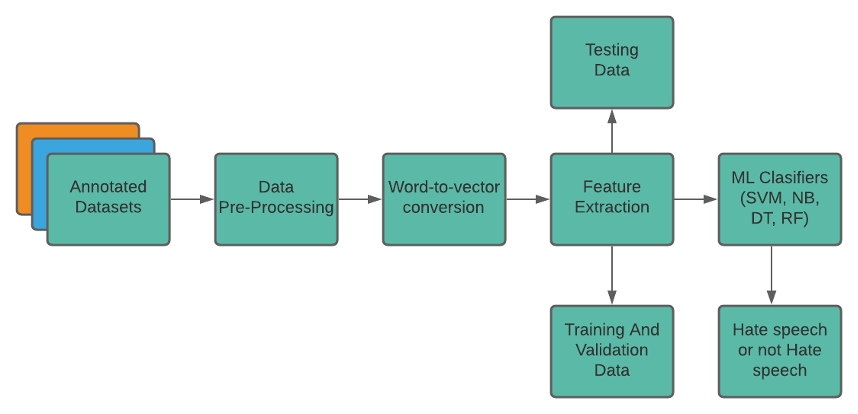
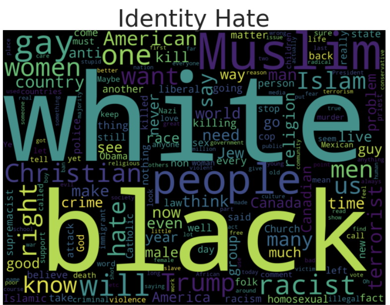
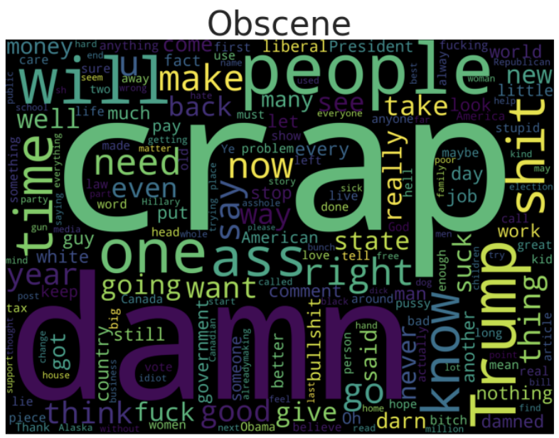

### Short Story - Social Media And Hate Speech:- Toxicity Interpretability and Classification

#### 1. Medium Article: https://medium.com/@preeti1998parihar/social-media-and-hate-speech-toxicity-interpretability-and-classification-e7798605367d
#### 2. Slide Share: https://www.slideshare.net/PreetiParihar11/social-media-and-hate-speech-toxicity-interpretability-and-classification
#### 3. Video: https://drive.google.com/file/d/1BBf6kDGbnS0kX-07m3mfl93taQOq91jy/view?usp=sharing
#### 4. Research Paper: https://arxiv.org/pdf/2108.01062.pdf

#### ML model pipeline for hate speech

#### WordCount representation of Toxicity micro-factors

#### Comments in each category

#### Abstract:

The internet and social media have become indispensable tools for disseminating and consuming information. One of the negatives of social media is online hate speech, which must be moderated. In this paper, I will look at how hate speech began, what its repercussions are, and how machine learning can be used to detect it.
